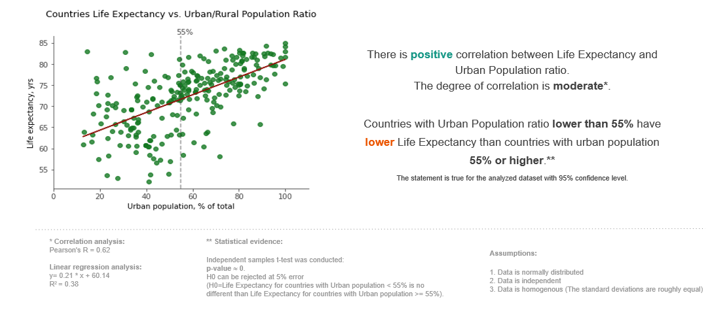
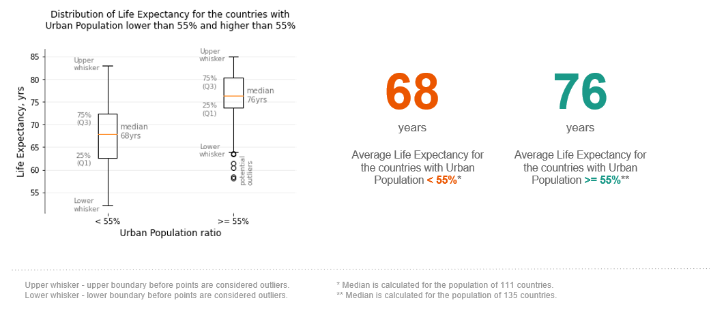
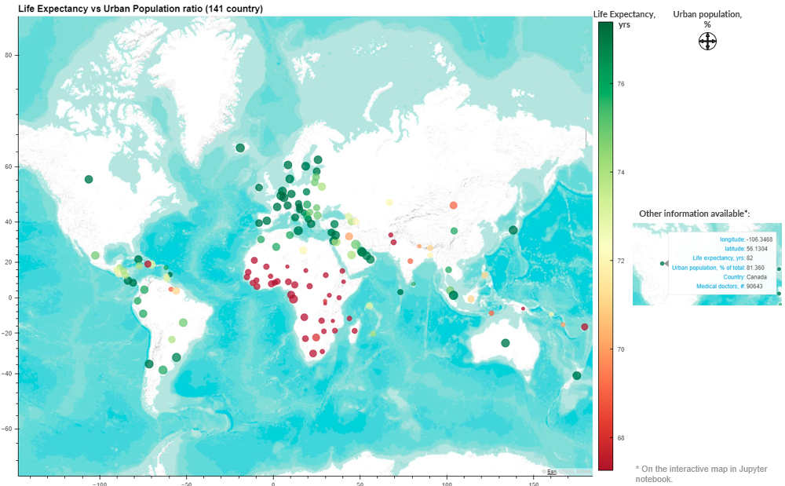

# Urban vs. Rural Population Analysis: Impact on Life Expectancy

## Description
This project investigates the correlation between urbanization and life expectancy across diverse countries and forms part of a broader analysis of global health data aimed at pinpointing regions most in need of support from organizations like the World Health Organization (WHO). The goal of the project is to deepen the understanding of global health disparities and uncover insights for evidence-based decision-making in healthcare planning and resource allocation. Through thorough analysis, regions requiring aid are pinpointed, while countries with outstanding health outcomes are highlighted, serving as benchmarks for global health advancement.

## Python Libraries Used
- Pandas
- Matplotlib
- SciPy
- NumPy
- Hvplot

## File Structure
- 'life_expectancy.ipynb': Jupyter Notebook with python script that cleans the data, uncovers trends and visualizes the findings.

### Data
Data sets were obtained from Kaggle and World Health Organization (WHO).

    - 'health_data.csv': CSV file that comprises demographic, health, economic, and social indicators for various countries, including life expectancy, unemployment rate, infant mortality, GDP, vaccination rates, urban and rural population percentages, and mortality rates from various causes. 
    - 'population.csv': CSV file with population information by gender from 1960 to 2021.
    - 'Medical_doctors.csv': CSV file with information about number of medical doctors by country by year. 
    - 'world_latitude_longtitude.csv': CSV file with countries geographical information for map visualization.

## Data processing steps
Script allows to perform the following steps of the analysis:

- Clean and prepare the data.
- Generate summary statistics.
- Identify outliers.
- Measure correlation between analyzed variables (Life Expectancy and Urban Population %).
- Create a scatter plot and a line plot to visualize data trends.
- Identify countries that are not following the overall trend.
- Perform statistical test to test the hypothesis. 
- Plot Life Expectancy and Urban Population ratio on a map.

## Data limitations
- Years: 2015 to 2019.
- Countries that did not have Life Expectancy and Immunization Rates for all analyzed years were excluded from the analysis:
Curacao,
Greenland,
Sint Maarten (Dutch part).
- Countries that did not have Male/Female ratio to calculate Life Expectancy for the entire population were assigned 50%:
Czech Republic,
Turkey.
- Life Expectancy for the entire population was calculated as weighted average between Male Life Expectancy and Female Life Expectancy. 
- 95 countries (63.33%) did not have complete ‘Year’ information the data was averaged out by years.
- Data frame that contains information by country with averaged information across the analyzed years has 246 countries.

## Analysis Results

Throughout the anaylsis linear regression analysis, correlation analysis, independent sample t-test were used to check statistical significance:
- LinregressResult(slope=0.20960452658895146, intercept=60.13577971371717, rvalue=0.6177675233644961, pvalue=2.7918422048609635e-27, stderr=0.017080576290189883, intercept_stderr=1.0555839781164265).
- PearsonRResult(statistic=0.6177675233644959, pvalue=2.79184220486113e-27).
- Ttest_indResult(statistic=-10.782843029791302, pvalue=8.933679816645654e-22)

To visualize the results the following graph types were created:
 - scatter plot to show relationship between Life Expectancy and Urban Population Ratio.

 

 - regression line.

 - box plots.

 - map visualization.

## Conclusion

- Correlation between Life Expectancy and size of Urban Population is moderate - 0.62.
- Countries with lower % of the urban population may require more support in healthcare.
- Develop infructructure in countries with lower urban population % may be an option to increase assessibility to healthcare and consequently increase Life Expectancy.

## References
https://www.kaggle.com/datasets/kiranshahi/life-expectancy-dataset?datasetId=1980580&sortBy=dateRun&tab=profile 
https://data.worldbank.org/indicator/SP.POP.TOTL.FE.ZS
https://www.kaggle.com/datasets/iamsouravbanerjee/world-population-dataset
https://www.kaggle.com/datasets/paultimothymooney/latitude-and-longitude-for-every-country-and-state

